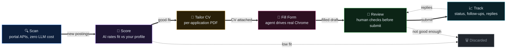

# career-autopilot

**AI-powered job search automation — from finding the job to a filled application form.**

An extended version of [santifer/career-ops](https://github.com/santifer/career-ops). On top of the original
discovery/scoring/tracking pipeline, this adds a local **auto-apply engine** (`extensions/apply-factory`)
that fills applications in your own browser via CDP trusted events — live-validated on
**LinkedIn Easy Apply, Greenhouse, Lever, and Ashby**.

## How it works



1. **Scan** — sweeps job portals through their public APIs (no LLM cost).
2. **Score** — an AI agent rates every posting against your CV and profile; low fits are discarded before you waste time.
3. **Tailor CV** — generates a per-application PDF from your master `cv.md`.
4. **Fill Form** — the apply engine opens the real form in your browser and fills it from your `answer-bank.yaml`.
5. **Review** — nothing is submitted without your review (default; see `extensions/apply-factory/config.yaml`).
6. **Track** — every application, follow-up, and reply lands in one tracker.

## The auto-apply engine

Modern application forms resist automation — LinkedIn's Easy Apply modal lives in an iframe and ignores
synthetic clicks (`event.isTrusted` checks). The engine works around this by driving your **real Chrome**
through the [Kimi WebBridge extension](https://chromewebstore.google.com/detail/kimi-webbridge/fldmhceldgbpfpkbgopacenieobmligc)
and CDP trusted events: screenshot → read → click, like a human would.

- Adapters: `extensions/apply-factory/prompts/kimi_*.md` (LinkedIn Easy Apply, Greenhouse, Lever, Ashby)
- Runbook with hard-won ATS quirks: `extensions/apply-factory/LINKEDIN_AUTO_APPLY.md`
- Your answers live in a **gitignored** `answer-bank.yaml` — copy `answer-bank.example.yaml` and fill in your values

**Data sources (for now):** LinkedIn, Greenhouse, Lever, Ashby — plus 90+ scan-only portal providers in `providers/`. More coming.

## Quick start

```bash
git clone https://github.com/ankit-songara/career-autopilot
cd career-autopilot
npm install
npm run setup:browser   # downloads Chromium for PDF generation (one-time, ~150MB)
```

For the auto-apply engine (Python):

```bash
pip install -r extensions/apply-factory/requirements.txt
```

Then open the repo in an AI coding CLI (Claude Code, Codex, OpenCode, Qwen, Kimi, …) and just start talking —
the onboarding flow (`doctor.mjs`) walks you through creating your `cv.md`, `config/profile.yml`, and `portals.yml`.

For Codex, see [CODEX.md](CODEX.md): run `codex` interactively in the repo root — slash commands are not
guaranteed there, so ask in plain language (e.g. "Run career-ops scan mode") — or headless with
`codex exec "your prompt"` for one-shot workers.
To use the auto-apply engine, also copy `extensions/apply-factory/answer-bank.example.yaml` to `answer-bank.yaml`
and install [Kimi WebBridge](https://chromewebstore.google.com/detail/kimi-webbridge/fldmhceldgbpfpkbgopacenieobmligc).

No personal data ships in this repo — bring your own resume.

## Responsible use

- **Nothing is submitted without human review** by default. Keep it that way until you fully trust the flow.
- Answers come from *your* answer bank — the engine never invents facts, experience, or authorization status.
- Automated interaction may violate a site's terms of service (LinkedIn's in particular). It drives *your* real
  browser session with *your* real answers — you are responsible for how you use it. See [LEGAL_DISCLAIMER.md](LEGAL_DISCLAIMER.md).
- Quality over quantity: the scoring step exists so you apply to fewer, better-fitting roles — not to spam recruiters.

## Credits

Built on the excellent open-source [career-ops](https://github.com/santifer/career-ops) by
[Santiago Fernández (santifer)](https://santifer.io) — the scanning, scoring, CV generation, and tracking
foundation is his work ([MIT licensed](LICENSE)). This repo adds the apply-factory engine, the answer bank,
and the browser-driving agent flow.

## Contributing

Contributions welcome — adapters for new job portals (`providers/`) and new ATS form flows
(`extensions/apply-factory/prompts/`) are the easiest places to start. See [CONTRIBUTING.md](CONTRIBUTING.md).

## License

[MIT](LICENSE)
